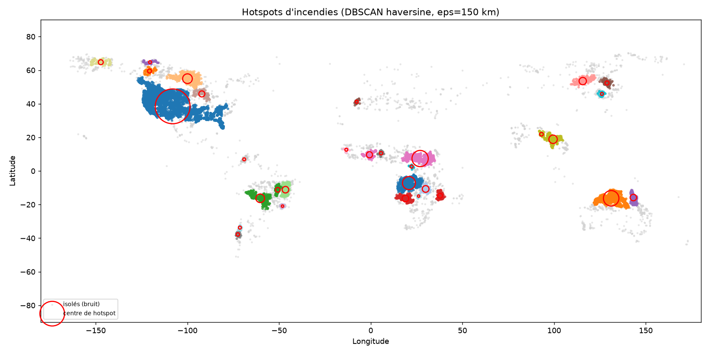
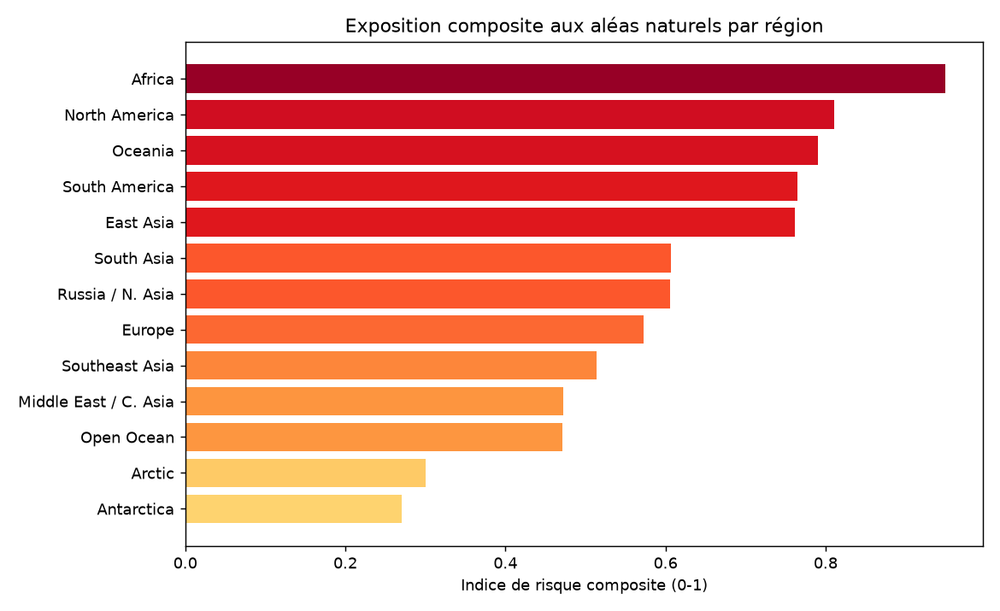

# Risques environnementaux — analyse spatio-temporelle (NASA EONET)

Support à la **gestion de crise et à la résilience** : à partir du flux
d'événements naturels géolocalisés de la NASA, **identifier les zones à forte
exposition**, comprendre les **dynamiques saisonnières** de chaque aléa et
**anticiper leur fréquence** — pour éclairer le pré-positionnement des moyens.

---

## 1. Problème métier

Les cellules de gestion de crise raisonnent sur trois questions :
**où** les aléas se concentrent (hotspots), **quand** (saisonnalité, tendance)
et **combien** en attendre demain (prévision). Ce projet répond aux trois à
partir d'une source ouverte et faisant autorité, en assumant explicitement les
biais de ce type de données (voir *Limites*).

## 2. Données

- **Source :** API **NASA EONET v3** — *Earth Observatory Natural Event
  Tracker* ([eonet.gsfc.nasa.gov](https://eonet.gsfc.nasa.gov/api/v3/events)),
  agrégateur d'événements naturels géolocalisés et datés (incendies, tempêtes,
  volcans, inondations, glace de mer…).
- **Ingestion reproductible :** paginée **par année** via les paramètres
  `start`/`end` (`python src/ingest.py`), endpoint vérifié en **juillet 2026**.
- **Volume :** **47 327 points d'observation** valides sur **≈19 500 événements
  distincts**, 2012–2026.
- **Structure clé :** un événement = une **liste de géométries** (points de
  trajectoire datés). Le pipeline aplatit chaque point en une ligne
  `event_id | catégorie | source | date | lon | lat | magnitude | …`, puis
  compte les **événements distincts** pour toute analyse de fréquence.
- **Données versionnées** (`data/raw/eonet_events.csv`, ~6 Mo) pour un repo
  auto-suffisant ; entièrement régénérables via l'API.

## 3. Méthodologie

| Étape | Module | Contenu |
|---|---|---|
| Ingestion | `src/ingest.py` | Pagination annuelle EONET v3, aplatissement des géométries, dédoublonnage |
| Structuration | `src/preprocessing.py` | Dates → année/mois/saison, filtrage coords, région (bounding boxes) + cellule 5°, flag ouvert/fermé |
| EDA | `src/eda.py` | Volume annuel, heatmap catégorie×région, saisonnalité mensuelle |
| Hotspots | `src/hotspots.py` | **DBSCAN haversine** (eps=150 km) sur les incendies + carte Plotly |
| Prévision | `src/forecast.py` | **Prophet** sur comptages mensuels, horizon 18 mois, 3 catégories |
| Indice de risque | `src/risk_index.py` | Composite fréquence/récence/diversité par cellule & région + carte |

Deux familles de techniques combinées (checklist portfolio) : **clustering
spatial non supervisé** + **séries temporelles**, complétées d'un indice
composite.

## 4. Résultats clés

### Points bruts ≠ événements

| Catégorie | Points bruts | Événements distincts |
|---|---|---|
| Severe Storms | 25 433 | 1 303 |
| Wildfires | 16 506 | 16 506 |
| Sea and Lake Ice | 3 910 | 157 |

Les tempêtes génèrent de longues trajectoires (beaucoup de points, peu
d'événements) ; les incendies sont nombreux et ponctuels. Compter les
**événements** évite qu'une tempête écrase le signal.

### Hotspots (DBSCAN, incendies)

**31 hotspots** détectés. Les plus intenses :

| Rang | Événements | Région | Période |
|---|---|---|---|
| 1 | 6 332 | Amérique du Nord (Ouest) | 2014–2026 |
| 2 | 1 382 | Afrique centrale | 2024–2026 |
| 3 | 1 256 | Nord de l'Australie | 2015–2026 |

Carte interactive : `reports/figures/eonet_hotspots_map.html`.

### Prévision (Prophet, 12 mois)

| Catégorie | Réalisé 12 derniers mois | Projeté 12 mois (IC 80 %) |
|---|---|---|
| Wildfires | 6 275 | **6 722** (4 365 – 9 073) |
| Floods | 527 | **534** (427 – 638) |
| Severe Storms | 93 | **90** (51 – 127) |

Les projections encadrent le réalisé récent — validation de bon sens du cycle
saisonnier capté.

### Indice de risque composite (régions)

| Région | Événements | Aléas | Récence | Indice |
|---|---|---|---|---|
| **Afrique** | 4 156 | 12 | 0,97 | **0,95** |
| Amérique du Nord | 8 173 | 8 | 0,68 | 0,81 |
| Océanie | 1 993 | 7 | 0,91 | 0,79 |

Carte par cellule 5° : `reports/figures/risk_index_map.html`.

| | |
|---|---|
|  |  |

## 5. Limites

- **Biais de couverture / reporting** — EONET agrège des sources dont le nombre
  et la finesse **augmentent avec le temps**. La forte hausse du volume après
  2023 reflète surtout un meilleur reporting, **pas nécessairement plus
  d'aléas**. Les comparaisons inter-années sont à interpréter avec prudence.
- **Sévérité absente** — pas de champ magnitude homogène entre catégories :
  l'indice pondère fréquence/récence/diversité, pas l'intensité réelle.
- **Régions par bounding boxes** — approximation grossière, sans frontières
  administratives ni reverse-geocoding fin.
- **Indice relatif et illustratif** — à recalibrer avec des données
  d'exposition et de vulnérabilité (population, infrastructures) pour un usage
  opérationnel.

## 6. Reproduction

```bash
conda create -n eonet python=3.11 -y && conda activate eonet
pip install -r requirements.txt

python src/ingest.py          # (ré)ingestion depuis l'API EONET (~1 min)
python src/preprocessing.py   # structuration spatio-temporelle
python src/eda.py             # figures EDA
python src/hotspots.py        # DBSCAN + carte
python src/forecast.py        # prévisions Prophet
python src/risk_index.py      # indice composite + carte
python notebooks/build_notebook.py   # notebook de synthèse
```

`random_state`/paramètres fixés ; toutes les sorties sont régénérées dans
`reports/`.

## 7. Structure du repo

```
03-environmental-risk-eonet/
├── data/raw/eonet_events.csv     # données versionnées (~6 Mo)
├── notebooks/
│   ├── 03_environmental_risk.ipynb
│   └── build_notebook.py
├── src/
│   ├── ingest.py         preprocessing.py   eda.py
│   ├── hotspots.py       forecast.py        risk_index.py
├── reports/
│   ├── figures/          # PNG + 2 cartes HTML interactives
│   └── *.csv             # tables (hotspots, prévisions, indices)
├── README.md
└── requirements.txt
```
